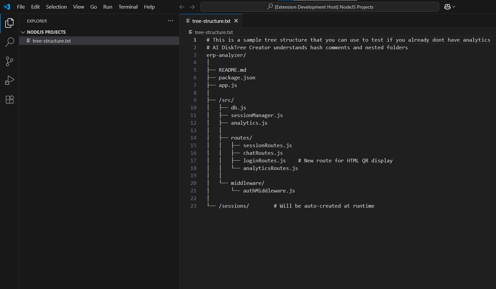
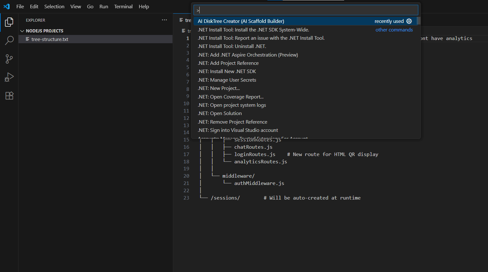
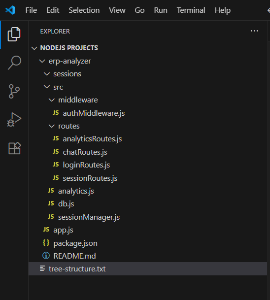
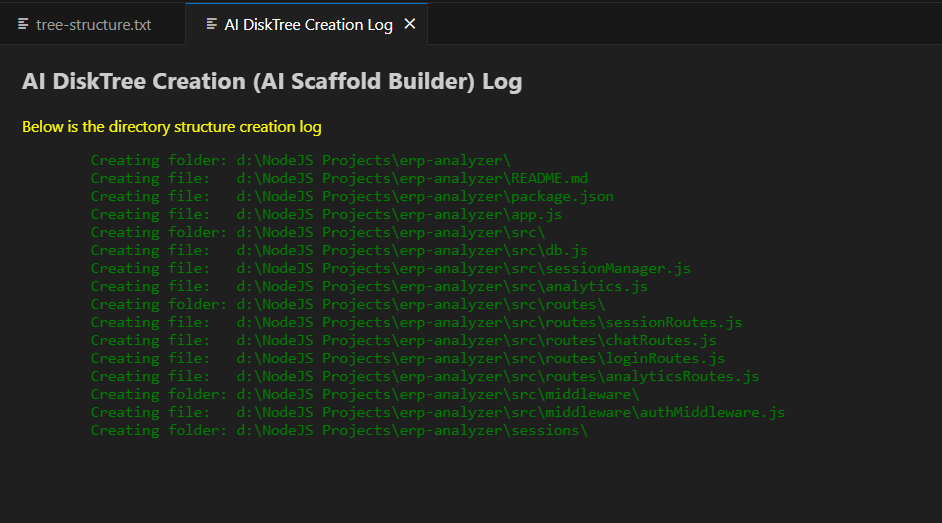
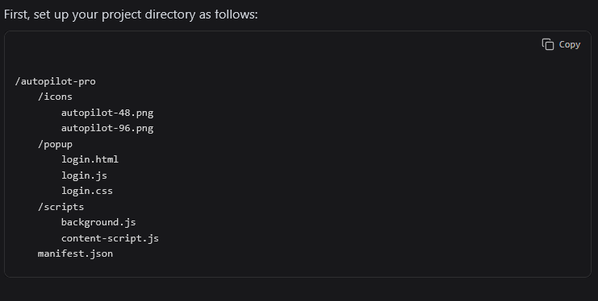

# AI DiskTree Creator (AI Scaffold Builder) README
    Speed up your workflow by instantly creating full folder and file structures in VS Code from AI-generated or manually written directory trees. Just paste your tree into a text file and let this extension convert it into real folders and files in seconds.

    "Paste. Run. Done. Instantly build real folder structures from AI-generated text trees."

## Prerequisites

    Make sure your VS Code workspace is open at the folder where you want the tree structure to be created.

    Install the 'AI DiskTree Creator (AI Scaffold Builder)' extension from the VS Code Marketplace.

## Start VS Code

Open your Projects folder inside VS Code. Creat a new file and paste your tree structure in it.

## Run the extension

Open the Command Palette (Ctrl+Shift+P or Cmd+Shift+P).

## Result in VS Code Explorer

Watch how folders and files appear instantly:

## See the Generation log

Everything the extension has done would be displayed here

## Flexible Tree Structure Parsing

Tool support flexible tree structure generated by a variety of AI Tools.

## How to Use

    Open Base Folder:
    Open the folder in VS Code where you want the directory structure to be created.

    Create a Text File:
    Inside the base folder, create a plain text file with any name (e.g., structure.txt).

    Paste Directory Structure:
    Paste your tree structure inside the file. You don't even need to save it just paste your structure. For example:

    my-project/
    ├── index.html
    ├── style/
    │   └── main.css
    └── scripts/
        ├── app.js
        └── utils.js

    Run the Extension:

        Open the Command Palette (Ctrl+Shift+P or Cmd+Shift+P).

        Search for and run 'AI DiskTree Creator (AI Scaffold Builder)':
        
        Generate from Tree File.

    Done!
    The extension will parse the tree and create corresponding folders and blank files.

## Supported Syntax

    Indentation using pipes and dashes (├──, └──, etc.).

    Nesting via spacing or indentation (based on consistent tree formatting).

    Optional support for tree roots ending with / to indicate folders.

## Notes

    Existing files/folders with the same name will not be overwritten.

    Only plain-text structures are supported (no JSON or YAML for now).

    Make sure your tree format is clean and consistent.

# AI DiskTree Creator

